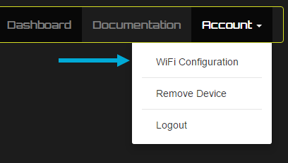

# Introduction

Welcome to the EVNEX Docs & API! 

You'll find everything here, right through from setting up and configuring your hardware, to more advanced features such as API use and proportional charging.

# Supported Browsers


<aside class="notice">
Internet Explorer/Edge is not currently supported as it lacks support for server sent events. This feature is currently <a href="https://developer.microsoft.com/en-us/microsoft-edge/platform/status/serversenteventseventsource/">under consideration</a> for Microsoft Edge.
</aside>

# EVSE Basics

Electric Vehicle Supply Equipment (EVSE) is the link between the wall plug and your electric vehicles charge system. Although often referred to as a ‘charger’ an AC EVSE does not directly manage the charging of your vehicle battery, this is done by electronics within the vehicle.

What an EVSE does do is ensure that the process of plugging in, charging and unplugging is managed in a safe, controlled manner. In short, the EVSE is responsible for communicating with the vehicle how much power it is able to provide, while providing safety features that mean the cord is never electrified when not attached to the vehicle. It will also disable power should a fault occur inside the vehicle.

For more information, one of the most common charge standards is described below.

## Connection Types

# Setting Up


Your ACI comes with a 2dBi RP-SMA antenna which can be swapped for a larger, higher gain antenna if required. Simply thread this into the connector on the ACI enclosure as shown below. It is recommended to do this after connecting to the screw terminal block to ease screwdriver access.

## Installation

todo

## Screw Terminal Connections

### Top Connector


Name | Meaning
---------- | -------
GND   | Power ground connection
N     | Power neutral connection
L     | Power live (phase) connection
CN-N  | Contactor neutral power connection (230V)
CN-L  | Contactor live (phase) power connection (230V)
SENSE | Contactor live sense input (connect to live line of contactor on the switched vehicle side)
ACTFB | Type 2 locking actuator feedback input
ACT+  | +12V output for type 2 locking actuator
ACT-  | -12V output for type 2 locking actuator


### Bottom Connector


Name | Meaning
---------- | -------
GND   | Signal ground connection
MENU  | Optional external menu button input (active low)
GPO   | General purpose output connection (low side switch)
12V   | Signal 12V output limited to XXmA
PULSE | Pulse input for optional energy meter
PILOT | Pilot signal control line
PROX  | Type 2 connector proximity input
GPI-  | Isolated general purpose negative input (select model)
GPI+  | Isolated general purpose positive input (select model)

## Creating Account

To use our online dashboard, you'll first have to head to the <a href="https://dashboard.evnex.io">EVNEX Dashboard</a> and create an account.

## Connecting to WiFi

Once you've created your account, login and then click Account -> WiFi Configuration.



Follow the instructions here, then log back into the dashboard to access your ACI. You may have to press the reset button on the ACI after WiFi setup before it shows up on the dashboard.

## Connection Modes

Your ACI has a multicolor display backlight which is used to indicate device connection status at a glance.
The following color codes show the status for each flash pattern.

Todo

# Interface

Todo

# GPI

The GPI (General Purpose Input) is an optional voltage input that can be set up to control the behavour of the EVSE dependent on external conditions.

The GPI takes a 0-12V signal which is displayed via the dashboard when enabled. The voltage input is fully isolated to 1kV over an optical isolation buffer. As such it is safe to be connected to home storage batteries or solar array voltages etc. provided that the voltage is appropriately stepped down to the 0-12V range.

As the signal is processed over an optical buffer, it's accuracy is limited to about +/-0.5V.

The GPI can be set up in dashboard to provide an array of functionality.

COMING SOON

# GPO

The GPO (General Purpose Output) is an optional switched output rated at TBD that can be set up to switch external loads dependent on charge conditions.

For example, the output could switch on a service light on a public charger to indicate 'in use'

The GPO can be set up in the dashboard.

COMING SOON

# API

The ACI is based on the Particle IoT platform, which means you can communicate with your ACI over an enterprise grade, secure API. We've abstracted charging functions and variables on top of the Particle API to give you easy access to device configuration and statistics. You can chose to use either the Particle REST API, or the Javascript API. For each example, select 'shell' for the REST API example or 'javascript' for the JS API example at the top of the code window.

## Setting Up

### If using Node.js:
`$ npm install particle-api-js`

### Or bower:
`bower install particle-api-js`

### Or for client side HTML include:
`<script type="text/javascript" src="//cdn.jsdelivr.net/particle-api-js/5/particle.min.js"> </script>`

<aside class="notice">
The above operations are necessary only when using the JS API.
</aside>

The REST API host is "https://api.particle.io", all requests are encrypted via TLS.

For our REST examples, we'll assume a terminal is being used for testing, as such 'curl' is prepended (a command line tool for testing client-side URL transfers).

## Authentication

Each EVNEX account has an associated unique access token that is used to authenticate all API requests. Your access token will expire every 90 days.

The easiest way to find your access token is by logging into the dashboard at dashboard.evnex.io, you'll find it on the first page.

<aside class="warning">This access token is the key to your device and shouldn't be shared.</aside>

## Logging In

```javascript
// Create a new particle object like so:
var Particle = require('particle-api-js'); //Not required for client side use
var particle = new Particle();

// Logging in:
particle.login({username: 'email@example.com', password: 'pass'}).then(
  function(data){
    console.log('API call completed on promise resolve: ', data.body.access_token);
  },
  function(err) {
    console.log('API call completed on promise fail: ', err);
  }
);
```
The Particle JS API uses <a href="https://spring.io/understanding/javascript-promises" target="_blank">promises</a>, in the example shown this enables easy handling of success/failure results for the login request.

<aside class="notice">
No login is required when using the REST API, instead you'll pass your access token through with each request.
</aside>

## Introduction to Functions

```javascript
var fnPr = particle.callFunction({ deviceId: deviceID, name: functionName, argument: 'argName,'+argValue, auth: accessToken });

  fnPr.then(
    function(data) {
      console.log('Function called succesfully:', data);
    }, function(err) {
      console.log('An error occurred:', err);
    });
```

```shell
# DEFINITION
POST /v1/devices/:deviceId/:functionName

# EXAMPLE REQUEST
$ curl https://api.particle.io/v1/devices/deviceID/functionName -d arg='argName,argValue' -d access_token=accessToken
```

To change settings on the ACI, we utilise 'device functions'.
Irrelevant of the operation, the process for calling a function is the same, we pass in the the following data:

Argument | Meaning | Example
---------- | ------- | ------
accessToken  | Your unique access token | ab12xxxxcd34
deviceID   | The device ID for the device you're accessing | 1234xxxx5678
functionName  |  The name of the function | 'setConfig'
argName  | The argument to pass to the function | 'MODE'
argValue | The integer value of the argument to pass to the function | 0

Instead of copying the same code each time, we'll just document the function name e.g. 'setConfig', the argument name e.g. 'MODE' and the allowable function arguments.

<aside class="notice">
We pass `argName` and `argValue` together with a comma separation, as these are parsed at the device end. e.g. 'MODE,'0
</aside>

## Setting Charger Mode
> This will set the charger mode to 'disabled'

```javascript
var fnPr = particle.callFunction({ deviceId: deviceID[selectedDeviceIndex], name: 'setConfig', argument: 'MODE,'+0, auth: accessToken });

  fnPr.then(
    function(data) {
      //console.log('Function called succesfully:', data);
    }, function(err) {
      console.log('An error occurred:', err);
    });
```

```shell
$ curl https://api.particle.io/v1/devices/deviceID/setConfig -d arg="MODE,0" -d access_token=accessToken
```

### Function Name:

`setConfig`

### Argument Name:

`MODE`

### Allowable Argument Values

Mode | Meaning | Value
---------- | ------- | -------
DISABLED   | EVSE Disabled | 0
ENABLED  | EVSE Enabled (normal mode) | 1
TIMER   | Timer Mode | 2
OCPP   | Open Charge Point Protocol Mode (ignores user input) | 3

<aside class="success">
We've included an example here to get you started!
</aside>

## Set Current Limit

This sets the dynamic current limit, it may be set to any value below your hard current limit.

### Function Name:

`setConfig`

### Argument Name:

`CURRENT`

### Allowable Argument Values

Value | Min Setting | Max Setting
---------- | ------- | -------
Charge Current Limit | 6 | 80

<aside class="notice">
The J1772 standard allows between 6 - 80A. If you attempt to set the current outside of the hard limit then the setting will be limited to the minimum/maximum respective setting.
</aside>

## Set Hard Current Limit

This sets the hardware defined current limit for your system.

### Function Name:

`setConfig`

### Argument Name:

`MAXCURRENT`

### Allowable Argument Values

Value | Min Setting | Max Setting
---------- | ------- | -------
Charge Current Limit | 6 | 80

<aside class="warning">This value should not be changed unless you know what you're doing. If this value exceeds the current carrying capability of your hardware then damage could occur.</aside>

## Introduction to Event Streams

```javascript
particle.getEventStream({ deviceId: deviceID, name: 'ACIData', auth: accessToken }).then(function(stream) {
  stream.on('event', function(data) {
    console.log("Event: " + data);
    
    //Optionally use the following to extract data from JSON format 
    var deviceData = data.data;
    parsedData = JSON.parse(deviceData);
    console.log("Parsed Data: " + parsedData);
  });
});
```
```shell
# DEFINITION
GET /v1/devices/:deviceId/events/:eventPrefix

# EXAMPLE REQUEST
curl https://api.particle.io/v1/devices/deviceID/events/ACIData?access_token=accessToken
```

The ACI sends data every 3 seconds via server sent events (SSE).
To subscribe to these data streams we need to set up an event listener.

The ACI currently sends the following information over SSE:

Name | Description
---------- | -------
GPI | General purpose input voltage (V)
IPAddr | Current device IP address
ISET | Current setting
PWR | Instantaneous charge power (W)
RAM | Available device RAM (Bytes)
RSSI | Signal strength (Subtract 127 for RSSI)
STATE | Charger state
TEMP | Device temperature


# OCPP

OCPP is currently awaiting deployment...
