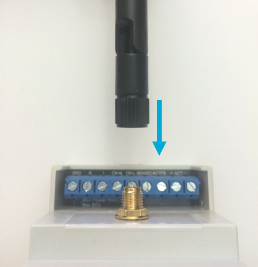
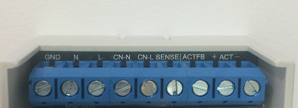
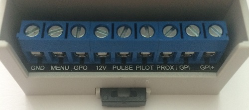

# Introduction

Welcome to the EVNEX Docs & API! You'll find everything here, right through from setting up and configuring your hardware, to more advanced features such as API use and proportional charging.

# Supported Browsers


<aside class="notice">
Internet Explorer is not currently supported
</aside>

# EVSE Basics

Electric Vehicle Supply Equipment (EVSE) is the link between the wall plug and your electric vehicles charge system. Although often referred to as a ‘charger’ an AC EVSE does not directly manage the charging of your vehicle battery, this is done by electronics within the vehicle.

What an EVSE does do is ensure that the process of plugging in, charging and unplugging is managed in a safe, controlled manner. In short, the EVSE is responsible for communicating with the vehicle how much power it is able to provide, while providing safety features that mean the cord is never electrified when not attached to the vehicle. It will also disable power should a fault occur inside the vehicle.

For more information, one of the most common charge standards is described below.

## Connection Types

# Setting Up



Your ACI comes with a 2dBi RP-SMA antenna which can be swapped for a larger, higher gain antenna if required. Simply thread this into the connector on the ACI enclosure as shown below. It is recommended to do this after connecting to the screw terminal block to ease screwdriver access.

## Installation

todo

## Screw Terminal Connections

### Top Connector



Name | Meaning
---------- | -------
GND   | Power ground connection
N     | Power neutral connection
L     | Power live (phase) connection
CN-N  | Contactor neutral power connection (230V)
CN-L  | Contactor live (phase) power connection (230V)
SENSE | Contactor live sense input (connect to live line of contactor on the switched vehicle side)
ACTFB | Type 2 locking actuator feedback input
ACT+  | +12V output for type 2 locking actuator
ACT-  | -12V output for type 2 locking actuator


### Bottom Connector



## Creating Account

## Connecting to WiFi

## Connection Modes

# Interface

# GPI

# GPO

# API

## Basics

## Authentication

## Logging In

> To authorize, use this code:

```ruby
require 'kittn'

api = Kittn::APIClient.authorize!('meowmeowmeow')
```

```python
import kittn

api = kittn.authorize('meowmeowmeow')
```

```shell
# With shell, you can just pass the correct header with each request
curl "api_endpoint_here"
  -H "Authorization: meowmeowmeow"
```

```javascript
const kittn = require('kittn');

let api = kittn.authorize('meowmeowmeow');
```

> Make sure to replace `meowmeowmeow` with your API key.

Kittn uses API keys to allow access to the API. You can register a new Kittn API key at our [developer portal](http://example.com/developers).

Kittn expects for the API key to be included in all API requests to the server in a header that looks like the following:

`Authorization: meowmeowmeow`

<aside class="notice">
You must replace <code>meowmeowmeow</code> with your personal API key.
</aside>

# Kittens

## Get All Kittens

```ruby
require 'kittn'

api = Kittn::APIClient.authorize!('meowmeowmeow')
api.kittens.get
```

```python
import kittn

api = kittn.authorize('meowmeowmeow')
api.kittens.get()
```

```shell
curl "http://example.com/api/kittens"
  -H "Authorization: meowmeowmeow"
```

```javascript
const kittn = require('kittn');

let api = kittn.authorize('meowmeowmeow');
let kittens = api.kittens.get();
```

> The above command returns JSON structured like this:

```json
[
  {
    "id": 1,
    "name": "Fluffums",
    "breed": "calico",
    "fluffiness": 6,
    "cuteness": 7
  },
  {
    "id": 2,
    "name": "Max",
    "breed": "unknown",
    "fluffiness": 5,
    "cuteness": 10
  }
]
```

This endpoint retrieves all kittens.

### HTTP Request

`GET http://example.com/api/kittens`

### Query Parameters

Parameter | Default | Description
--------- | ------- | -----------
include_cats | false | If set to true, the result will also include cats.
available | true | If set to false, the result will include kittens that have already been adopted.

<aside class="success">
Remember — a happy kitten is an authenticated kitten!
</aside>

## Get a Specific Kitten

```ruby
require 'kittn'

api = Kittn::APIClient.authorize!('meowmeowmeow')
api.kittens.get(2)
```

```python
import kittn

api = kittn.authorize('meowmeowmeow')
api.kittens.get(2)
```

```shell
curl "http://example.com/api/kittens/2"
  -H "Authorization: meowmeowmeow"
```

```javascript
const kittn = require('kittn');

let api = kittn.authorize('meowmeowmeow');
let max = api.kittens.get(2);
```

> The above command returns JSON structured like this:

```json
{
  "id": 2,
  "name": "Max",
  "breed": "unknown",
  "fluffiness": 5,
  "cuteness": 10
}
```

This endpoint retrieves a specific kitten.

<aside class="warning">Inside HTML code blocks like this one, you can't use Markdown, so use <code>&lt;code&gt;</code> blocks to denote code.</aside>

### HTTP Request

`GET http://example.com/kittens/<ID>`

### URL Parameters

Parameter | Description
--------- | -----------
ID | The ID of the kitten to retrieve

